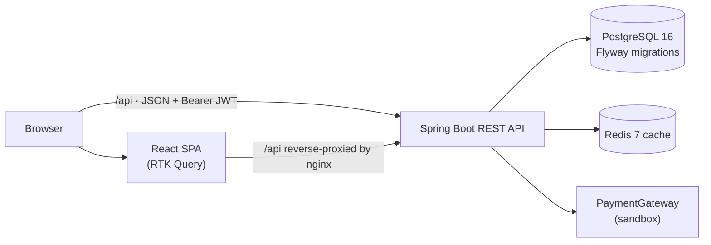

# ShopSphere

[](https://github.com/samiyapathan0212/ShopSphere/actions/workflows/ci.yml)


**ShopSphere is a deployed, production-style full-stack e-commerce application built as a
portfolio project.** A React + TypeScript single-page storefront talks to a stateless
Spring Boot REST API secured with JWT access tokens and HttpOnly refresh cookies, backed
by PostgreSQL (Flyway-managed schema) and a Redis catalogue cache. It covers the complete
customer journey — sign-in, browsing a curated demo catalogue, cart, wishlist, sandbox
checkout with payment confirmation, order history, tracking and cancellation — alongside
role-protected admin order management. The backend ships with 111 automated tests and
GitHub Actions CI, the whole stack runs locally with one Docker Compose command, and the
production build is deployed as two Render web services with nginx reverse-proxying
`/api` to the API.

## Live demo

- **Storefront:** https://shopsphere-frontend-fkka.onrender.com/
- **API health check:** https://shopsphere-api-h29l.onrender.com/api/health

> **Note:** Both services run on Render's free tier, which sleeps instances after
> periods of inactivity. The first request after an idle period can take a while to
> respond — give it a moment to wake up, then retry.

## Feature highlights

### Customer

- **Accounts** — registration and login with BCrypt-hashed passwords.
- **Sessions** — short-lived JWT access token plus a rotating, single-use refresh token
  delivered only in an `HttpOnly` cookie; the session is silently restored on page load.
- **Storefront** — home, product listing and product-detail pages over a curated demo
  catalogue, with client-side text search, category/price filters and sorting.
- **Cart** — add items, change quantity, remove and clear, with a live navbar badge and
  server-computed totals.
- **Wishlist** — save and remove products; badges read real server state.
- **Checkout** — shipping-address form, order summary and a single guarded submission
  that cannot create duplicate orders.
- **Sandbox payment** — the checkout transaction charges a sandbox gateway and the
  confirmation screen renders the approved/declined result.
- **Orders** — confirmation with a real order number, paginated history, detail with
  item/money snapshots, cancellation while the lifecycle allows it, and current-status
  tracking.
- **Theming** — light/dark preference persisted in the browser.

### Security

- **No fallback signing key** — startup fails fast if `JWT_SECRET` is missing or weak;
  the app never signs tokens with a built-in default.
- **Token hygiene** — HS384 access tokens (`JWT_EXPIRATION_MS`, 15 minutes by default);
  opaque refresh tokens stored only as SHA-256 hashes, rotated on every refresh and
  rejected once expired or revoked.
- **Cookie safety** — the refresh cookie is `HttpOnly`, `Secure` (configurable),
  `SameSite=Lax` and scoped to `/api/auth`; it never appears in a JSON body.
- **Role-based authorization** — server-side `@PreAuthorize` checks (`CUSTOMER` /
  `ADMIN`) on every protected endpoint, returning JSON `401`/`403` with generic messages.
- **CORS allow-list** — origins come from an environment variable; credentials are
  allowed and the wildcard origin is deliberately unsupported.
- **Hardened configuration** — stateless sessions, `jakarta.validation` on every request,
  Swagger toggleable off (and off on the deployed API), database and Redis bound to
  `localhost` in Docker, Redis authentication, container health checks and restart
  policies.

### Admin

- **Role-gated area** — server-side enforcement (the API answers `403` regardless of UI
  guards); navigation and routes are hidden from non-admins as convenience only.
- **Order operations** — view all customer orders, filter by status, inspect details
  (items, totals, address, customer id, payment status) and advance status only through
  valid lifecycle transitions (invalid transitions are rejected with `409`).
- **Backend-only management APIs** — product, category and inventory CRUD exist and are
  role-protected, but have **no admin UI** yet.
- **Not implemented** — analytics, coupon management and user management; admin accounts
  are created by promoting a user in the database (registration always yields
  `CUSTOMER`).

## Technology stack

| Layer | Tools |
| --- | --- |
| **Frontend** | React 18 · TypeScript 5.7 · Vite 6 · Redux Toolkit + RTK Query · React Router 6 · hand-written CSS with design tokens · nginx (serves the built SPA) |
| **Backend** | Java 23 · Spring Boot 3.4.1 (Web, Security, Data JPA, Validation, Cache) · Maven · JJWT · springdoc OpenAPI |
| **Database** | PostgreSQL 16 · Flyway migrations (`ddl-auto: validate` — the schema is never mutated at runtime) |
| **Cache** | Redis 7 through Spring's cache abstraction (cache-aside category/product caching with configurable TTLs) |
| **Authentication** | JWT access tokens (HS384) + single-use rotating refresh sessions in `HttpOnly` cookies · BCrypt password hashing |
| **Testing** | JUnit 5 · Mockito · AssertJ · MockMvc · H2 (test-scope only) · TypeScript type-check + Vite production build · GitHub Actions CI |
| **Deployment** | Docker · Docker Compose · nginx reverse proxy · Render (two web services) |

## Architecture



- **Two Render web services in production** — the frontend service runs nginx, which
  serves the static SPA and proxies `/api/` to the backend service
  (`frontend/nginx.conf`). Locally the same image runs in Docker Compose; during Vite
  development the dev server proxies `/api` to `http://localhost:8080` instead.
- **Layers** — controller → service → repository, with request/response DTOs at every
  boundary: JPA entities never leave the service layer.
- **Validation and errors** — `jakarta.validation` constraints on every request record
  (field-level error map); domain exceptions map to 400/404/409 through one central
  handler with a consistent JSON error envelope.
- **Transactional checkout** — stock validation, order creation, payment and cart
  clearing run in a single transaction; any failure rolls the whole thing back.
- **Pessimistic inventory** — stock rows are locked in ascending product-id order to
  serialize concurrent checkouts without deadlocks, then converted to a sale or released.
- **Cache-aside Redis** — category and product services read and populate caches through
  a small helper; cache failures are logged and never break a request.

## Repository structure

```
ShopSphere/
├── backend/                          Spring Boot REST API
│   ├── src/main/java/com/shopsphere/backend/
│   │   ├── config/                   Cache, CORS and OpenAPI configuration
│   │   ├── controller/               REST controllers with @PreAuthorize role checks
│   │   ├── domain/                   JPA entities
│   │   ├── dto/                      request/response records
│   │   ├── exception/                global handler + error envelope
│   │   ├── mapper/ · repository/ · security/ · service/ · util/ · validation/
│   ├── src/main/resources/
│   │   ├── application.yml           env-driven configuration
│   │   └── db/migration/             Flyway migrations V1–V10
│   ├── src/test/java/                automated test suite (111 tests)
│   └── Dockerfile
├── frontend/                         React SPA
│   ├── src/
│   │   ├── app/                      Redux store + RTK Query API slices
│   │   ├── components/ · layouts/ · pages/
│   │   └── mocks/                    curated demo catalogue + client-side filters
│   ├── nginx.conf                    SPA fallback + /api reverse proxy
│   ├── vite.config.ts                dev server (proxies /api → localhost:8080)
│   └── Dockerfile
├── .github/workflows/ci.yml          CI: mvn -B verify + npm ci && npm run build
├── docker-compose.yml                postgres · redis · backend · frontend
├── .env.example                      environment template (placeholders only)
└── README.md
```

## Key application workflows

### Authentication

- `POST /api/auth/register` (always `CUSTOMER`) and `POST /api/auth/login` verify a
  BCrypt hash, then return an access token (HS384, 15-minute default) plus a rotating
  refresh token set as an `HttpOnly` cookie scoped to `/api/auth`.
- Only the SHA-256 hash of the refresh token is persisted. Each `POST /api/auth/refresh`
  revokes the presented token and issues a new one (single-use rotation); the frontend
  calls it once on boot to restore the session silently, and `POST /api/auth/logout`
  revokes server-side.
- RTK Query attaches `Authorization: Bearer …` to every API call; the access token lives
  in the Redux auth slice, never in `localStorage`.

### Cart and wishlist

- `GET /api/cart` loads the signed-in customer's cart (the cart row is created lazily on
  first read); add, quantity-change, remove and clear operations are all ownership-scoped
  in the service layer.
- The navbar cart/wishlist badges read real server counts and are skipped entirely while
  signed out, so no fake count can survive a reload.
- Wishlist add/remove is customer-only; reading the wishlist is open to any signed-in
  role. Anonymous visitors are prompted to sign in.

### Checkout and payment (sandbox)

- `POST /api/checkout` runs in **one transaction**: validate the cart → reserve stock
  (pessimistic locks) → create the order with immutable item/address snapshots → charge
  the sandbox gateway → clear the cart.
- Approved payment: order confirmed, payment `PAID`, and the confirmation page renders
  the real order number, totals, address snapshot and payment status.
- Declined payment (the sandbox honours a `simulateFailure` test hook): the reservation
  is released, the order is cancelled and the cart stays intact so the customer can
  retry. Insufficient stock is rejected with `409` — stock is never oversold.
- Prices, shipping and totals are always computed server-side from catalogue records,
  never from client input. No card data is collected anywhere; the gateway hides behind a
  `PaymentGateway` interface, so swapping the sandbox for a real provider means
  implementing that interface.

### Order management

- **Customer:** paginated history (`GET /api/orders`), detail with item snapshots and
  money breakdown, `GET /api/orders/{id}/tracking` for current status and
  cancellability, and `POST /api/orders/{id}/cancel` while the lifecycle permits it
  (invalid states return `409`).
- **Admin:** `GET /api/admin/orders` across all users (filterable by status), detail
  including the customer id and payment status, and `PUT /api/admin/orders/{id}/status`
  restricted to transitions allowed by `OrderStatus.canTransitionTo` — anything else is
  rejected with `409` and surfaced in the UI.

### Inventory

- One inventory row per product; stock changes take pessimistic write locks.
- Checkout reserves stock up-front, converts the reservation to a sale when payment is
  approved, and releases it on decline; a zero balance fails with
  `InsufficientStockException` → `409`.
- Availability is readable by any signed-in user (`GET /api/inventory/{productId}`);
  listing and updates are admin-only (no UI yet).
- Missing rows are materialised lazily with zero quantity; migration `V10` seeds usable
  stock for the 14 demo products so checkout works on a fresh database.

## Database and migrations

Flyway owns all schema evolution at startup (`classpath:db/migration`); Hibernate only
validates the schema at runtime (`ddl-auto: validate`).

| Migration | Purpose |
| --- | --- |
| `V1__baseline.sql` | Baseline marker |
| `V2__create_users_table.sql` | Users (unique email, BCrypt hash, role) |
| `V3__create_refresh_tokens_table.sql` | Refresh tokens (unique hash, expiry, revocation) |
| `V4__create_categories_and_products.sql` | Categories and products |
| `V5__create_cart_wishlist_and_review_tables.sql` | Carts, cart items, wishlists, wishlist items, reviews |
| `V6__create_inventory_order_payment_tables.sql` | Inventory, orders, order items, payments |
| `V7__fix_cart_item_quantity_type.sql` | Cart item quantity column correction |
| `V8__fix_review_rating_type.sql` | Review rating column correction |
| `V9__seed_shopsphere_demo_catalog.sql` | Demo catalogue seed (14 canonical products, ids 1–14) |
| `V10__seed_demo_inventory.sql` | Demo inventory seed (usable stock for the demo catalogue) |

Uniqueness is enforced in the database for user email, refresh-token hash, category name,
product SKU, one cart and wishlist per user, one review per user/product, one inventory
row per product, order number, and one payment per order.

## API documentation and endpoints

The API is served at `http://localhost:8080` and, through the nginx/Vite proxies, at
`/api/...` from the frontend origin. `GET /api/health` is public and returns:

```json
{"status":"UP","service":"shopsphere-backend","timestamp":"2026-10-10T15:16:54.641145952Z"}
```

**Swagger/OpenAPI:** springdoc is enabled by default locally (`SWAGGER_ENABLED=true` in
`.env.example`) — Swagger UI at `http://localhost:8080/swagger-ui.html`, OpenAPI JSON at
`/v3/api-docs`. **The deployed Render API does not expose Swagger/OpenAPI** — those
endpoints are not served there (verified against the live backend); set
`SWAGGER_ENABLED=false` to disable them in any environment.

Scope legend: **Public** (no token) · **Signed-in** (any role) · **Customer** ·
**Admin**. Except for the auth endpoints and health, every endpoint requires a Bearer
token — this includes catalogue reads, so anonymous API clients receive `401`.

| Area | Endpoints | Scope |
| --- | --- | --- |
| Health | `GET /api/health` | Public |
| Auth | `POST /api/auth/register` · `POST /api/auth/login` · `POST /api/auth/refresh` · `POST /api/auth/logout` | Public |
| Session | `GET /api/auth/me` | Signed-in |
| Categories | `GET /api/categories` · `GET /api/categories/{id}` | Signed-in |
| | `POST /api/categories` · `PUT /api/categories/{id}` · `DELETE /api/categories/{id}` | Admin |
| Products | `GET /api/products` · `GET /api/products/{id}` | Signed-in |
| | `POST /api/products` · `PUT /api/products/{id}` · `DELETE /api/products/{id}` | Admin |
| Reviews | `GET /api/products/{id}/reviews` · `GET /api/products/{id}/reviews/summary` | Signed-in |
| | `POST /api/products/{id}/reviews` · `PUT /api/reviews/{reviewId}` · `DELETE /api/reviews/{reviewId}` | Customer |
| Cart | `GET /api/cart` | Signed-in |
| | `POST /api/cart/items` · `PUT /api/cart/items/{productId}` · `DELETE /api/cart/items/{productId}` · `DELETE /api/cart` | Customer |
| Wishlist | `GET /api/wishlist` | Signed-in |
| | `POST /api/wishlist/items/{productId}` · `DELETE /api/wishlist/items/{productId}` | Customer |
| Checkout | `POST /api/checkout` | Customer |
| Orders | `GET /api/orders` · `GET /api/orders/{id}` · `GET /api/orders/{id}/tracking` · `POST /api/orders/{id}/cancel` | Customer |
| Payments | `GET /api/payments/{id}` · `POST /api/payments/{id}/process` · `POST /api/payments/{id}/verify` | Customer |
| Inventory | `GET /api/inventory/{productId}` | Signed-in |
| | `GET /api/inventory` · `PUT /api/inventory/{productId}` | Admin |
| Admin orders | `GET /api/admin/orders` · `GET /api/admin/orders/{id}` · `PUT /api/admin/orders/{id}/status` | Admin |
| Role checks | `GET /api/test/admin` · `GET /api/test/customer` | Admin / Customer (temporary verification helpers) |

## Local setup

### Prerequisites

- **Required:** Docker with Docker Compose (e.g. Docker Desktop) and Git.
- **For running services directly:** JDK 23 + Maven 3.9+ (backend), Node.js 22 + npm
  (frontend — matches CI and the Docker build).

### Full stack with Docker (recommended)

```powershell
git clone https://github.com/samiyapathan0212/ShopSphere.git
cd ShopSphere

# Create your local environment file — .env is git-ignored and must never be committed
Copy-Item .env.example .env
# Open .env and set a strong JWT_SECRET (e.g. run: openssl rand -base64 64).
# .env.example ships only a clearly-marked development placeholder.

docker compose up -d --build
docker compose ps          # all four services should be healthy
```

| Service | URL |
| --- | --- |
| Storefront (nginx) | http://localhost:3000 |
| Backend API | http://localhost:8080/api/health |
| Swagger UI (local default) | http://localhost:8080/swagger-ui.html |
| PostgreSQL | 127.0.0.1:5432 (localhost-only) |
| Redis | 127.0.0.1:6379 (localhost-only) |

> **API routing:** `frontend/nginx.conf` reverse-proxies `/api/` to the backend URL
> configured there (the deployed Render API), so the Dockerised storefront works against
> the live backend. For a **fully local** API loop, use the Vite dev server below, which
> proxies `/api` to your local backend on port 8080. Keep the
> `CORS_ALLOWED_ORIGINS=http://localhost:3000` example from `.env.example` — browsers
> send an `Origin` header on POSTs, and an unlisted origin is refused with `403`.

### Infrastructure only + local processes

```powershell
docker compose up -d postgres redis

# Backend on http://localhost:8080 (the backend reads environment variables, not .env)
cd backend
$env:JWT_SECRET = '<your base64 secret>'           # required — startup fails without it
$env:CORS_ALLOWED_ORIGINS = 'http://localhost:3000' # allow the Vite dev origin
mvn spring-boot:run

# Frontend on http://localhost:3000 (Vite proxies /api → localhost:8080)
cd ..\frontend
npm install
npm run dev
```

### Environment variables

`.env` is read by Docker Compose and is never committed. The backend reads the same
variables from its environment:

| Variable | Purpose / default |
| --- | --- |
| `DB_URL`, `DB_USERNAME`, `DB_PASSWORD` | PostgreSQL connection (defaults target a local `shopsphere` database) |
| `POSTGRES_DB`, `POSTGRES_USER`, `POSTGRES_PASSWORD` | Database bootstrap for the Dockerised PostgreSQL |
| `REDIS_HOST`, `REDIS_PORT`, `REDIS_PASSWORD` | Redis connection (defaults: `localhost:6379`, no password) |
| `JWT_SECRET` | **Required.** base64 signing key for access tokens — no fallback; generate one (`openssl rand -base64 64`) and never commit it |
| `JWT_EXPIRATION_MS` | Access-token lifetime (default `900000` = 15 min) |
| `REFRESH_TOKEN_EXPIRATION_MS` | Refresh-token lifetime (default `2592000000` = 30 days) |
| `REFRESH_TOKEN_COOKIE_SECURE` | `Secure` attribute on the refresh cookie (default `true`) |
| `CORS_ALLOWED_ORIGINS` | Comma-separated origin allow-list; never `*` |
| `SWAGGER_ENABLED` | Expose Swagger UI/OpenAPI (default `true`; use `false` in production) |
| `SERVER_PORT` | Backend HTTP port (default 8080) |
| `VITE_API_URL` | Frontend API base URL (default `/api`) |
| `CATEGORY_CACHE_TTL_SECONDS`, `PRODUCT_CACHE_TTL_SECONDS`, `PRODUCT_LIST_CACHE_TTL_SECONDS` | Catalogue cache TTLs |
| `CATALOG_MAX_PAGE_SIZE` | Maximum catalogue page size |

Stop everything with `docker compose down` (add `-v` to also delete the database and
cache volumes).

## Testing and verification

### Automated

- **Backend — 111 tests** covering services, persistence (H2-backed `@DataJpaTest`),
  validation and controller authorization (MockMvc + role checks):

  ```powershell
  cd backend
  mvn -B test        # what developers run
  mvn -B verify      # what CI runs
  ```

- **Frontend — type-checked production build** (`tsc -b && vite build`). There is no
  frontend unit-test suite today (see limitations):

  ```powershell
  cd frontend
  npm run build
  ```

### CI

GitHub Actions (`.github/workflows/ci.yml`) runs on every push to `main`/`master` and on
pull requests: `mvn -B verify` on JDK 23 (Temurin) and `npm ci && npm run build` on
Node 22.

### Manual verification

Automated coverage is backend-only; verify the full stack by walking the flows against
the running application:

1. `curl http://localhost:8080/api/health` → `status: UP`.
2. In the browser: register → login → add to cart → wishlist → checkout → order history
   → cancel while eligible.
3. As an admin (promote a user's role in the database): orders list → status filter →
   status update; confirm a customer token still receives `403` on admin endpoints.

## Security and configuration notes

- **Secrets** — `.env` is git-ignored; only `.env.example` with clearly-marked
  development placeholders is tracked. `JWT_SECRET` has no default: a missing or weak
  key stops startup instead of falling back to a known value. No real secrets, tokens or
  credentials are stored in this repository.
- **Passwords and tokens** — BCrypt hashes only (never returned); access tokens are
  signed JWTs carrying id/email/role; refresh tokens are opaque, stored as SHA-256
  hashes, single-use and rotated every refresh.
- **Cookie** — the refresh token travels only in an `HttpOnly`, `Secure`,
  `SameSite=Lax` cookie scoped to `/api/auth`, never in a response body.
- **Authorization** — two roles (`CUSTOMER`, `ADMIN`) enforced with method-level
  annotations plus ownership checks in the service layer; generic JSON `401`/`403`
  responses do not reveal which rule failed. Frontend route guards are defence-in-depth
  convenience only.
- **CORS** — environment-driven allow-list with credentials enabled; the wildcard
  origin is unsupported (browsers reject `*` together with credentials).
- **Statelessness** — no server-side sessions; CSRF protection is disabled by design
  because every mutation requires the `Authorization` header and the refresh cookie is
  `SameSite=Lax`.
- **Transport and infrastructure** — PostgreSQL and Redis are published on `127.0.0.1`
  only; Redis runs with `--requirepass` wired to `REDIS_PASSWORD` and its health check
  authenticates (set a real password in `.env` for anything beyond throwaway local use);
  containers have health checks and `restart: unless-stopped`; Swagger/OpenAPI is
  disabled on the deployed API.
- **Validation** — `jakarta.validation` constraints on every request record produce a
  field-level error map; one central exception handler renders a consistent JSON error
  envelope (400/404/409).
- **Payments** — sandbox only: no card data is collected and no provider credentials
  are stored.

## Current limitations and future improvements

### Current limitations

- **The storefront catalogue is mock-backed.** Home, listing, detail and wishlist pages
  render curated demo data from `frontend/src/mocks/`, with search, filtering, sorting
  and pagination applied client-side. Every **transactional** operation (cart, wishlist
  membership, checkout, orders, payments, inventory) goes through the backend and real
  PostgreSQL records; the complete backend catalogue API is simply not yet consumed by
  these pages.
- **Payments are simulated.** The sandbox gateway approves by default (with a
  `simulateFailure` test hook), no card data is collected, and there is no refund
  endpoint.
- **No admin UI for products, categories or inventory.** The CRUD APIs exist and are
  role-protected, but no management screens are built. Analytics, coupon management and
  user management are not implemented. Admin accounts must be promoted in the database —
  registration always produces a `CUSTOMER`.
- **No frontend automated tests.** Frontend assurance comes from the type-checked
  production build and manual verification; all 111 automated tests are backend.
- **Direct API usage requires an initial cart read.** `POST /api/cart/items` returns
  `404` until `GET /api/cart` has been called (the cart row is created lazily); the web
  UI always loads the cart first, so this only affects API consumers.
- **Admin order views show the customer id only** (no name/email), payment reads are
  ownership-scoped to the customer, and there is no refund endpoint — the admin view
  shows payment status only.
- **No carrier tracking history** — the backend stores a single current status, not
  scan events.
- **The catalogue API requires authentication**, so anonymous API clients cannot browse
  products (the mock storefront does not need this).

### Future improvements

- Wire the storefront pages to the real catalogue API (server-side search, filtering
  and sorting).
- Build admin screens for products, categories and inventory.
- Replace the sandbox gateway behind `PaymentGateway` with a real provider (including
  refunds).
- Add a frontend test suite alongside the backend suite.

## Author

**Samiya Pathan** — [github.com/samiyapathan0212](https://github.com/samiyapathan0212)

Project repository: **[github.com/samiyapathan0212/ShopSphere](https://github.com/samiyapathan0212/ShopSphere)**